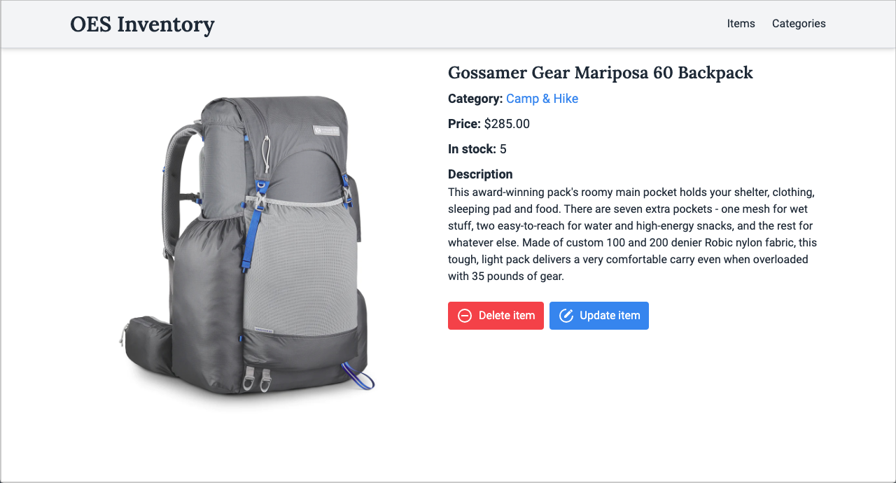

# Inventory Application

**[Click here to view the live site](https://inventory-app-ma.glitch.me)**

## How to Use

1. [Head to the live site](https://inventory-app-ma.glitch.me) on any device (mobile, tablet or desktop - it doesn't matter)
1. Browse around the site and perform the following operations:
   - Add new items to the inventory
   - **Create** new categories to organize inventory items
   - **Read**/view details about items and categories in the inventory
   - **Update** details about items and categories in the inventory
   - **Delete** items and categories from the inventory
1. All the product data is stored in a database, so your changes will persist!

https://github.com/matthewaubert/inventory-app/assets/132402803/63cd84de-f883-4f11-8080-6a3fa470f739

## About This Project

This project was built as part of [The Odin Project: NodeJS course]("https://www.theodinproject.com/lessons/nodejs-inventory-application") in order to practice the following skills:
- Use the _Express Application Generator_ tool to create a skeleton website and application
- Use a database (MongoDB) to store my application's data
- Implement the [**M**odel-**V**iew-**C**ontroller (MVC)](https://developer.mozilla.org/en-US/docs/Glossary/MVC) software design pattern
  - Build models to define what data structures my app should contain
  - Set up routes for requesting different information and templates (i.e. views) to render the data as HTML to be displayed in the browser
  - Build controllers for updating the model and/or view in response to input from users of my app
- Perform **C**reate-**R**ead-**U**pdate-**D**elete (CRUD) operations in my app
- Work with forms in Express using my chosen templating language (EJS)
- Deploy my application to production

## Technologies Used

### Languages
- JavaScript
- EJS - Embedded JavaScript templating language
- CSS

### Frameworks and Tools
- Express
- MongoDB, Mongoose
- Tailwind CSS
- He - for encoding and decoding HTML entities
- Dotenv - for keeping my database connection strings and API keys secret
- Multer - Express middleware for handling user-uploaded images
- Cloudinary - for hosting images

## Understanding the Problem

Build a mock inventory app for an imaginary business.

My app needs to have pages (routes) to allow users to perform CRUD operations on my categories and items.

## Plan

Review my [notes](docs/notes.md) to see my planning process.

## Credits

None of the item images are my own. They were obtained from the websites of their respective brands solely for the educational purpose of building this project.
